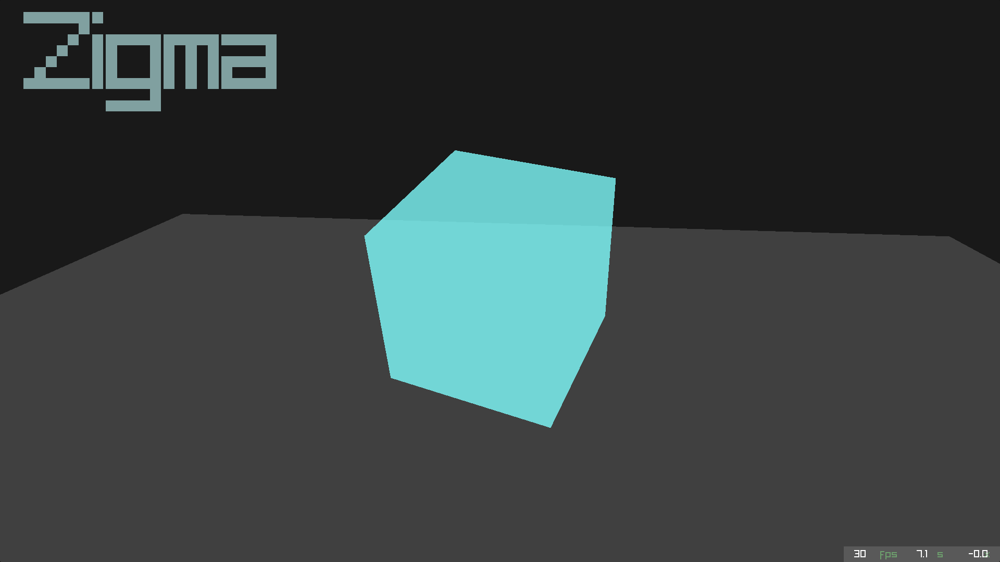
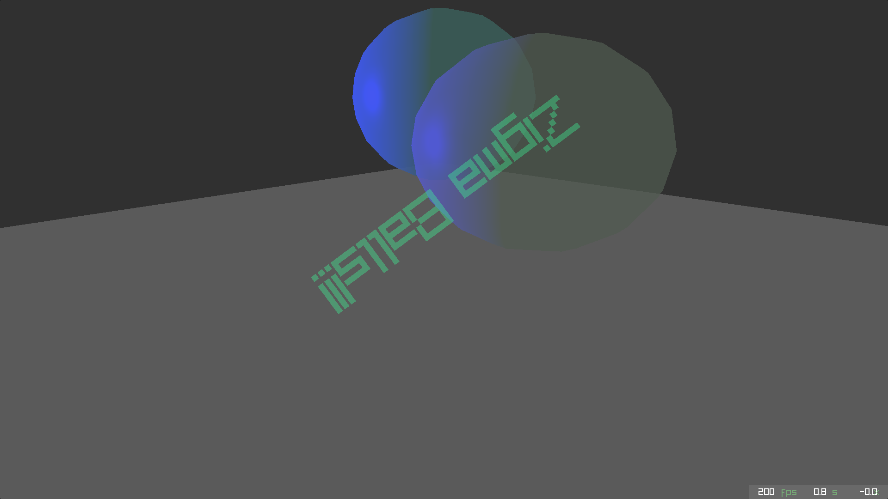
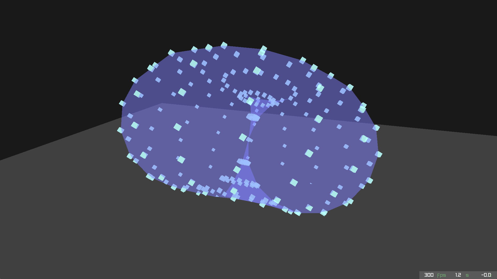

# Zigma demo engine

A minimal, modular Zig + Raylib framework for building audiovisual demos on Linux.

## Features

- **Entity Component System (ECS):**
  Lightweight ECS implementation for organizing logic and effects

- **Variable Timelines:**
  Work with multiple timelines all with different speeds and direction of time

- **Event-Driven Components:**
  Components can be attached to timelines by events for realtime mutation

- **Raylib Backend:**
  Hardware-accelerated 2D/3D graphics and audio via Raylib.

## Requirements

- Zig 0.13 or newer
- Raylib (linked dynamically or statically)
- Linux

## Build, Run & Test

```sh
zig build run
# or
zig build run -Ddemo=default
```
```sh
zig build test
```

## Control

| Shortcut | Description |
| --- | --- |
| Esc | Quit |
| f | Fullscreen |
| + | Increase main timeline speed a bit |
| - | Decrease main timeline speed a bit |
| Shift + | Increase main timeline speed a lot |
| Shift - | Decrease main timeline speed a lot |
| Right | Jump a bit forward on the main timeline |
| Left | Jump a bit backwards on the main timeline |
| Shift Right | Jump a lot forward on the main timeline |
| Shift Left | Jump a lot backwards on the main timeline |

## Examples
```zig
const zigma = @import("zigma");

pub fn main() void {
  // Initialize
  zigma.init(.{.title = "Zigma test", .width = 1920, .height = 1080, .fps = 30});
  defer zigma.deinit();

  var world = zigma.create();
  defer zigma.destroy(world);

  // Setup world
  _ = world.entity("camera").camera(.{})
  .event(.{.duration = 60, .repeat = 2, .pattern = .PingPong, .motion = .Smooth})
    .position(-5, 0.5, 2);

  _ = world.entity("background")
  .color(25, 25, 25, 255);

  // Add models
  _ = world.entity("cube").model(.{.type = "cube"})
  .color(128, 255, 255, 200)
  .event(.{.duration = 60, .repeat = 10, .pattern = .PingPong, .motion = .Smooth})
    .rotation(1, 0, 1);


  while(zigma.render(world)){}
}
```

### [Default](./default/main.zig)


### [Balls](./balls/main.zig)


### [Spawn](./spawn/main.zig)

